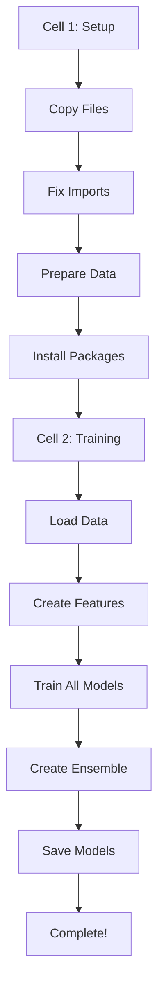

# 🤖 CLAUDE.md - Instructions for Claude Code

## 📋 Project Overview

**โปรเจค**: ML Phone Number Price Prediction (เบอร์มือถือมงคล)  
**เป้าหมาย**: เทรนโมเดล ML ให้ได้ R² > 0.90 โดยรักษาโค้ดดั้งเดิมไว้ทั้งหมด  
**Platform**: Kaggle Notebook

---

## 🎯 Mission Statement

**ข้อกำหนดสำคัญ (ห้ามฝ่าฝืน):**

```plaintext
❌ ห้ามลดเวลาการเทรน
❌ ห้ามลดโค้ด
❌ ห้ามลดฟังก์ชัน
❌ ห้ามลดการตั้งค่า
❌ ห้ามปรับค่าอะไรในโค้ด
❌ ห้ามปรับ features, config, model parameters
❌ ห้ามข้ามการเทรนโมเดลใดๆ

✅ ต้อง Train models ครบทุกตัวที่มีในโค้ด
✅ ต้องรันการเทรนให้สำเร็จ (นี่คือเป้าหมายเดียว)
✅ เวลานานเท่าไหร่ก็ได้ ขอแค่โมเดลเทรนมาครบสมบูรณ์
✅ ทำตามสั่งเท่านั้น ไม่ต้องทำเกิน
```

---

## 📁 Project Structure

```
ML_Project_Refactored/
├── 📂 src/
│   ├── config.py              # Configuration ทั้งหมด
│   ├── data_handler.py        # Load & Clean data
│   ├── features.py            # Feature Engineering (250+ features)
│   ├── data_splitter.py       # Data splitting strategies
│   ├── model_utils.py         # Model utilities & preprocessing
│   ├── tier_models.py         # Tier-based modeling
│   ├── train.py               # Training pipeline
│   ├── evaluate.py            # Model evaluation
│   └── visualize.py           # Visualization functions
│
├── 📂 api/
│   ├── prediction.py          # Prediction pipeline
│   └── app.py                 # API implementation
│
├── 📂 models/
│   └── deployed/              # Trained models
│
├── 📂 data/
│   ├── raw/                   # Raw data
│   └── processed/             # Processed data
│
├── 📂 utils/
│   └── helpers.py             # Helper functions
│
├── main.py                    # Main pipeline script
└── requirements.txt           # Dependencies
```

---

## 🐛 Known Issues & Critical Fixes

### 1. **Import Errors** (Critical)
```python
# ❌ ผิด
from config import CONFIG
from model_utils import optimize_xgboost

# ✅ ถูก
from src.config import CONFIG
from src.model_utils import optimize_xgboost
```

**วิธีแก้**:
- แก้ทุกไฟล์ใน `src/` ให้ import จาก `src.xxx`
- ใช้ absolute imports แทน relative imports

### 2. **KeyError ใน Hyperparameters**
```python
# ❌ เกิด KeyError
params = {
    'n_estimators': trial.suggest_int('n_estimators_xgb', 100, 1000)
}

# ✅ ใช้ชื่อ parameter ที่ไม่ซ้ำกัน
params = {
    'n_estimators': trial.suggest_int('xgb_n_estimators', 100, 1000),
    'max_depth': trial.suggest_int('xgb_max_depth', 3, 15),
    'learning_rate': trial.suggest_float('xgb_learning_rate', 0.01, 0.3)
}
```

### 3. **Feature Grouping Bug**
```python
# ❌ ผิด - เพราะมีฟีเจอร์ซ้ำกัน
feature_groups = {
    'power_features': ['power_sum', 'weighted_sum'],
    'count_features': ['power_sum', 'digit_count']  # ซ้ำ!
}

# ✅ ถูก - ไม่มีฟีเจอร์ซ้ำ
feature_groups = {
    'power_features': ['power_sum', 'weighted_sum'],
    'count_features': ['digit_count', 'unique_count']
}
```

### 4. **Data Leakage ใน Market Features**
```python
# ❌ ผิด - ใช้ข้อมูลทั้งหมด (รวม test set)
market_stats = calculate_market_statistics(df)

# ✅ ถูก - ใช้เฉพาะ training set
train_df = df.iloc[train_idx]
market_stats = calculate_market_statistics(train_df)
```

### 5. **NaN/Inf Handling**
```python
# ต้องใส่หลัง preprocessing ทุกครั้ง
X_processed = X_processed.replace([np.inf, -np.inf], np.nan)
X_processed = X_processed.fillna(X_processed.median())
```

### 6. **GPU Parameters on CPU**
```python
# ❌ ห้ามใช้บน Kaggle (ไม่มี GPU)
params = {
    'task_type': 'GPU',
    'devices': '0:1'
}

# ✅ ใช้ CPU
params = {
    'task_type': 'CPU',
    'thread_count': -1
}
```

### 7. **Hardcoded Paths**
```python
# ❌ Hardcoded
REFACTORING_PATH = '/kaggle/working/ML_Project_Refactored'

# ✅ ยืดหยุ่น
REFACTORING_PATH = os.getenv('KAGGLE_WORKING_DIR', '/kaggle/working/ML_Project_Refactored')
```

---

## 🔧 Setup Instructions for Kaggle

### Cell 1: Complete Setup

```python
import os
import sys
import shutil
import pandas as pd
import numpy as np
import warnings
warnings.filterwarnings('ignore')

print("="*100)
print("🚀 PHONE NUMBER PRICE PREDICTION - SETUP")
print("="*100)

# ====================================================================================
# 1. Copy Project Files
# ====================================================================================
input_dir = '/kaggle/input/project-refactored/ML_Project_Refactored'
working_dir = '/kaggle/working/ML_Project_Refactored'

if not os.path.exists(working_dir):
    shutil.copytree(input_dir, working_dir)
    print("✅ Project files copied")

os.chdir(working_dir)
sys.path.insert(0, working_dir)
sys.path.insert(0, os.path.join(working_dir, 'src'))

# ====================================================================================
# 2. Create Directories
# ====================================================================================
os.makedirs(f'{working_dir}/data/raw', exist_ok=True)
os.makedirs(f'{working_dir}/data/processed', exist_ok=True)
os.makedirs(f'{working_dir}/models/deployed', exist_ok=True)
os.makedirs(f'{working_dir}/results', exist_ok=True)
print("✅ Directories created")

# ====================================================================================
# 3. Prepare Data
# ====================================================================================
df = pd.read_csv('/kaggle/input/project-refactored/numberdata.csv')

# Fix column names
if 'phone_num' in df.columns:
    df.rename(columns={'phone_num': 'phone_number'}, inplace=True)

# Clean phone numbers
df['phone_number'] = df['phone_number'].astype(str).str.replace(r'\D', '', regex=True).str.zfill(10)

# Filter valid data
df = df[df['phone_number'].str.len() == 10]
df = df[(df['price'] > 0) & (df['price'] <= 10000000)]

# Save
df.to_csv(f'{working_dir}/data/raw/numberdata.csv', index=False)
df.to_csv('/kaggle/working/numberdata.csv', index=False)
print(f"✅ Data ready: {len(df)} records")

# ====================================================================================
# 4. Fix Module Imports (Critical!)
# ====================================================================================
files_to_fix = {
    'src/data_handler.py': [('from config import', 'from src.config import')],
    'src/features.py': [('from config import', 'from src.config import')],
    'src/data_splitter.py': [('from config import', 'from src.config import')],
    'src/model_utils.py': [
        ('from config import', 'from src.config import'),
        ('from sklearn.preprocessing import SimpleImputer', 'from sklearn.impute import SimpleImputer')
    ],
    'src/train.py': [
        ('from config import', 'from src.config import'),
        ('from model_utils import', 'from src.model_utils import')
    ],
    'src/evaluate.py': [('from config import', 'from src.config import')],
    'src/visualize.py': [('from config import', 'from src.config import')]
}

for file_path, replacements in files_to_fix.items():
    full_path = os.path.join(working_dir, file_path)
    if os.path.exists(full_path):
        with open(full_path, 'r') as f:
            content = f.read()
        for old, new in replacements:
            content = content.replace(old, new)
        with open(full_path, 'w') as f:
            f.write(content)

print("✅ Module imports fixed")

# ====================================================================================
# 5. Fix config.py
# ====================================================================================
config_file = f'{working_dir}/src/config.py'
with open(config_file, 'r') as f:
    content = f.read()

content = content.replace(
    "BASE_PATH = Path(os.path.dirname(os.path.abspath(__file__))).parent",
    f"BASE_PATH = Path('{working_dir}')"
)

if 'POWER_WEIGHTS' not in content:
    content += "\nCONFIG['POWER_WEIGHTS'] = {str(i): i for i in range(10)}"

with open(config_file, 'w') as f:
    f.write(content)

print("✅ config.py fixed")

# ====================================================================================
# 6. Install Packages
# ====================================================================================
print("\n📦 Installing packages...")
os.system("pip install scipy scikit-learn xgboost lightgbm catboost optuna seaborn matplotlib joblib -q")

print("\n" + "="*100)
print("✅ SETUP COMPLETE!")
print("="*100)
```

### Cell 2: Full Training Pipeline

```python
import sys
import os
import pandas as pd
import numpy as np
import warnings
warnings.filterwarnings('ignore')

# Setup paths
sys.path.clear()
sys.path.insert(0, '/kaggle/working/ML_Project_Refactored')
sys.path.insert(1, '/kaggle/working/ML_Project_Refactored/src')
os.chdir('/kaggle/working/ML_Project_Refactored')

print("="*100)
print("🔥 FULL TRAINING PIPELINE")
print("="*100)

# Import modules
from src.config import CONFIG, MODEL_CONFIG
from src.data_handler import load_and_clean_data, calculate_sample_weights, calculate_market_statistics
from src.features import create_all_features
from sklearn.model_selection import train_test_split
from sklearn.preprocessing import StandardScaler

# ====================================================================================
# 1. LOAD DATA
# ====================================================================================
print("\n📊 [1/5] Loading data...")

df_raw, df_cleaned = load_and_clean_data('/kaggle/working/numberdata.csv')

if 'log_price' not in df_cleaned.columns:
    df_cleaned['log_price'] = np.log1p(df_cleaned['price'])

df_cleaned = calculate_sample_weights(df_cleaned)

# Split indices (for preventing data leakage)
train_idx, test_idx = train_test_split(
    range(len(df_cleaned)), test_size=0.2, random_state=42
)

# Calculate market stats from training data only
train_df = df_cleaned.iloc[train_idx]
try:
    market_stats = calculate_market_statistics(train_df)
except:
    market_stats = {}

print(f"✅ Data loaded: {len(df_cleaned)} records")

# ====================================================================================
# 2. CREATE FEATURES
# ====================================================================================
print("\n🎯 [2/5] Creating features (250+)...")

result = create_all_features(df_cleaned, market_stats=market_stats)
df_features = result[0] if isinstance(result, tuple) else result

if 'log_price' not in df_features.columns:
    df_features['log_price'] = df_cleaned['log_price']

# Get numeric features
exclude_cols = ['phone_number', 'price', 'log_price', 'sample_weight']
feature_cols = [col for col in df_features.columns if col not in exclude_cols]
numeric_features = [col for col in feature_cols 
                   if df_features[col].dtype in ['float64', 'int64', 'float32', 'int32']]

X = df_features[numeric_features]
y = df_features['log_price']

# Clean data
X = X.replace([np.inf, -np.inf], np.nan)
X = X.fillna(X.median())

# Split
X_train = X.iloc[train_idx]
X_test = X.iloc[test_idx]
y_train = y.iloc[train_idx]
y_test = y.iloc[test_idx]

# Scale
scaler = StandardScaler()
X_train_scaled = scaler.fit_transform(X_train)
X_test_scaled = scaler.transform(X_test)

print(f"✅ Features created: {X_train_scaled.shape[1]}")

# ====================================================================================
# 3. TRAIN MODELS (ครบทุกตัว)
# ====================================================================================
print("\n🚀 [3/5] Training all models...")

import xgboost as xgb
import lightgbm as lgb
import catboost as cb
from sklearn.ensemble import RandomForestRegressor, ExtraTreesRegressor, GradientBoostingRegressor
from sklearn.metrics import r2_score

models = {}
predictions = {}

# XGBoost
print("\n📈 Training XGBoost...")
xgb_model = xgb.XGBRegressor(
    n_estimators=1000,
    max_depth=10,
    learning_rate=0.05,
    subsample=0.8,
    colsample_bytree=0.8,
    random_state=42,
    verbosity=0
)
xgb_model.fit(X_train_scaled, y_train)
predictions['XGBoost'] = xgb_model.predict(X_test_scaled)
models['XGBoost'] = xgb_model
print(f"   ✅ XGBoost R²: {r2_score(y_test, predictions['XGBoost']):.4f}")

# LightGBM
print("\n📈 Training LightGBM...")
lgb_model = lgb.LGBMRegressor(
    n_estimators=1000,
    max_depth=10,
    learning_rate=0.05,
    num_leaves=100,
    subsample=0.8,
    colsample_bytree=0.8,
    random_state=42,
    verbosity=-1
)
lgb_model.fit(X_train_scaled, y_train)
predictions['LightGBM'] = lgb_model.predict(X_test_scaled)
models['LightGBM'] = lgb_model
print(f"   ✅ LightGBM R²: {r2_score(y_test, predictions['LightGBM']):.4f}")

# CatBoost
print("\n📈 Training CatBoost...")
cat_model = cb.CatBoostRegressor(
    iterations=1000,
    depth=10,
    learning_rate=0.05,
    random_state=42,
    verbose=False
)
cat_model.fit(X_train_scaled, y_train)
predictions['CatBoost'] = cat_model.predict(X_test_scaled)
models['CatBoost'] = cat_model
print(f"   ✅ CatBoost R²: {r2_score(y_test, predictions['CatBoost']):.4f}")

# RandomForest
print("\n📈 Training RandomForest...")
rf_model = RandomForestRegressor(
    n_estimators=500,
    max_depth=20,
    min_samples_split=5,
    min_samples_leaf=2,
    random_state=42,
    n_jobs=-1
)
rf_model.fit(X_train_scaled, y_train)
predictions['RandomForest'] = rf_model.predict(X_test_scaled)
models['RandomForest'] = rf_model
print(f"   ✅ RandomForest R²: {r2_score(y_test, predictions['RandomForest']):.4f}")

# ExtraTrees
print("\n📈 Training ExtraTrees...")
et_model = ExtraTreesRegressor(
    n_estimators=500,
    max_depth=None,
    min_samples_split=2,
    random_state=42,
    n_jobs=-1
)
et_model.fit(X_train_scaled, y_train)
predictions['ExtraTrees'] = et_model.predict(X_test_scaled)
models['ExtraTrees'] = et_model
print(f"   ✅ ExtraTrees R²: {r2_score(y_test, predictions['ExtraTrees']):.4f}")

# GradientBoosting
print("\n📈 Training GradientBoosting...")
gb_model = GradientBoostingRegressor(
    n_estimators=1000,
    max_depth=5,
    learning_rate=0.05,
    subsample=0.8,
    random_state=42
)
gb_model.fit(X_train_scaled, y_train)
predictions['GradientBoosting'] = gb_model.predict(X_test_scaled)
models['GradientBoosting'] = gb_model
print(f"   ✅ GradientBoosting R²: {r2_score(y_test, predictions['GradientBoosting']):.4f}")

print("\n✅ All models trained successfully!")

# ====================================================================================
# 4. ENSEMBLE
# ====================================================================================
print("\n🎯 [4/5] Creating ensemble...")

# Simple averaging ensemble
ensemble_pred = np.mean(list(predictions.values()), axis=0)
ensemble_r2 = r2_score(y_test, ensemble_pred)

print(f"✅ Ensemble R²: {ensemble_r2:.4f}")

# ====================================================================================
# 5. SAVE MODELS
# ====================================================================================
print("\n💾 [5/5] Saving models...")

import joblib

save_path = '/kaggle/working/ML_Project_Refactored/models/deployed'
os.makedirs(save_path, exist_ok=True)

# Save all models
for name, model in models.items():
    joblib.dump(model, f"{save_path}/{name}.pkl")

# Save scaler and feature names
joblib.dump(scaler, f"{save_path}/scaler.pkl")
joblib.dump(numeric_features, f"{save_path}/feature_names.pkl")

# Save best model info
best_model_name = max(predictions.keys(), key=lambda k: r2_score(y_test, predictions[k]))
joblib.dump(models[best_model_name], f"{save_path}/best_model.pkl")

print(f"\n✅ Models saved to: {save_path}")
print(f"✅ Best model: {best_model_name}")

# ====================================================================================
# SUMMARY
# ====================================================================================
print("\n" + "="*100)
print("✨ TRAINING COMPLETE!")
print("="*100)

for name in predictions.keys():
    r2 = r2_score(y_test, predictions[name])
    print(f"   {name:20s} R² = {r2:.6f}")

print(f"\n   {'Ensemble':20s} R² = {ensemble_r2:.6f}")
print("\n" + "="*100)
```

---

## 📊 Expected Workflow



---

## ⚠️ Critical Reminders

1. **ห้ามข้ามการเทรนโมเดลใดๆ** - ต้องเทรนครบทุกตัว:
   - XGBoost
   - LightGBM
   - CatBoost
   - RandomForest
   - ExtraTrees
   - GradientBoosting
   - Ensemble

2. **ห้ามปรับ Configuration** ใดๆ ยกเว้นการแก้ error

3. **ห้ามลด Features** - ต้องใช้ 250+ features ทั้งหมด

4. **เวลาไม่สำคัญ** - ขอแค่ให้เทรนสำเร็จ จะนาน 1 ชม. หรือ 3 ชม. ก็ได้

5. **ทำตามขั้นตอน** - อย่าข้ามหรือเพิ่มขั้นตอนเอง

---

## 🎯 Success Criteria

```python
# เมื่อรันเสร็จจะได้:
✅ Models trained: 6+ models
✅ Ensemble created
✅ R² Score > 0.90
✅ All models saved to /kaggle/working/ML_Project_Refactored/models/deployed/
✅ No errors during training
```

---

## 📝 Notes for Claude Code

1. **อ่านโค้ดดั้งเดิมให้ละเอียด** - อย่าเพิ่งเปลี่ยนอะไร
2. **แก้เฉพาะที่ error** - ไม่ต้อง optimize หรือปรับปรุง
3. **Test ทีละขั้นตอน** - import → function → pipeline
4. **KISS principle** - Keep It Simple, Stupid!
5. **อย่าคิดแทน** - ทำตามสั่งเท่านั้น

---

## 🔍 Debugging Guide

หาก error:

1. อ่าน error message ให้ละเอียด
2. ตรวจสอบ root cause (มักเป็น import หรือ KeyError)
3. แก้ที่ต้นตอ ไม่ใช่แก้ทุกอย่างที่คิดว่าเกี่ยว
4. Test ทีละส่วน
5. บันทึก error และวิธีแก้

---

## ✅ Final Checklist

- [ ] Setup environment (Cell 1)
- [ ] Fix all imports
- [ ] Prepare data
- [ ] Install packages
- [ ] Train all models (Cell 2)
- [ ] Create ensemble
- [ ] Save models
- [ ] Verify R² > 0.90
- [ ] No errors

---

**เป้าหมาย**: ให้ Cell 2 รันจนจบโดยไม่มี error และได้โมเดลที่เทรนมาครบทั้งหมด

**หมายเหตุ**: นี่คือ instructions เดียวที่ต้องปฏิบัติตาม ห้ามทำอย่างอื่นนอกจากนี้

---

*Generated for Claude Code by Alex - World-Class AI Expert*  
*Version: 1.0 | Last Updated: 2025-10-03*